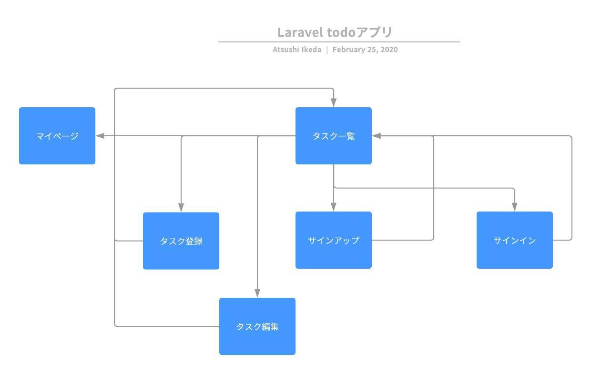
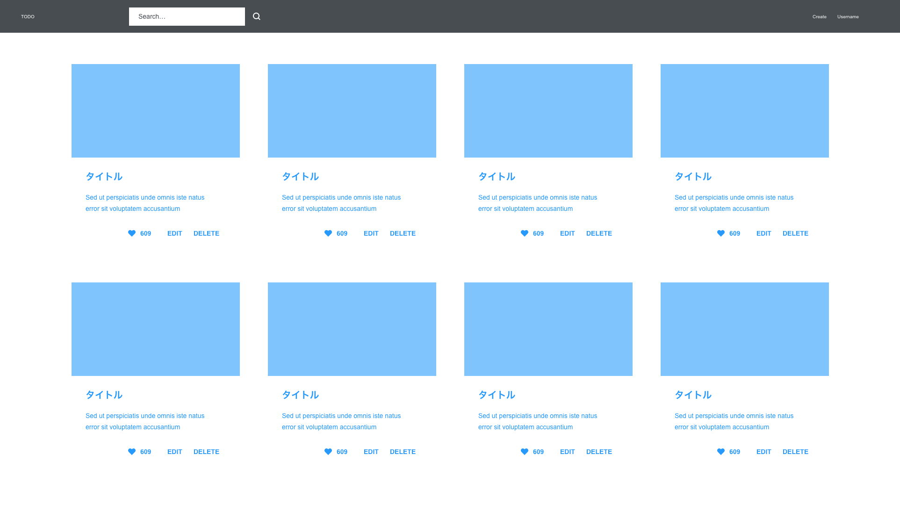

# Laravelを利用したTODOアプリの作成

## 実施する内容
- TODOアプリの作成(チーム開発)

## 要件
### 機能一覧
#### 必須
- タスクの作成ができる
  - 画像の投稿ができる
  - 以下のバリデーションを実装する
    - 入力必須
    - 30文字以内(title)
    - 140文字以内(contents)
- タスクの一覧表示ができる
- タスクの編集ができる
  - 以下のバリデーションを実装する
    - 入力必須
    - 30文字以内(title)
    - 140文字以内(contents)
- タスクの削除ができる
- 認証機能を擁している
  - サインアップ機能
  - サインイン機能
  - サインアウト機能

#### 任意
- タスクの表示順を登録日が新しい順にする
- タスクの検索ができる
- 画像の投稿ができる
- マイページの作成
  - 自分が投稿したタスクのみが表示される
- タスクのブックマークができる
- タスクのブックマークを解除することができる
- タスクにコメントができる
- 自分が投稿したタスクのみ編集できる
- 自分が投稿したタスクのみ削除できる

### 画面遷移図


### ワイヤーフレーム(TOPページ)


### ERD


### テーブル定義
### テーブル名: tasks
| 列名        | データ型    | NOT NULL | デフォルト | 備考                 |
| ----------- | ----------- | -------- | ---------- | -------------------- |
| id          | BIGINT      | YES      |            | PK                   |
| title       | VARCHAR(30) | YES      |            | タスクの題名が入る   |
| contents    | VARCHAR(140)| NO       |            | タスクの詳細が入る   |
| image_at    | TEXT        | NO       |            |                      |
| user_id     | BIGINT      | NO       |            |                      |
| created_at  | TIMESTAMP   | NO       |            | タスクの登録日       |
| updated_at  | TIMESTAMP   | NO       |            | タスクの更新日       |

### テーブル名: users
| 列名        | データ型    | NOT NULL | デフォルト | 備考                 |
| ----------- | ----------- | -------- | ---------- | -------------------- |
| id          | BIGINT      | YES      |            | PK                   |
| name        | VARCHAR(30) | NO       |            |                      |
| email       | VARCHAR(30) | NO       |            |                      |
| password    | VARCHAR(90) | NO       |            |                      |
| created_at  | TIMESTAMP   | NO       |            |                      |
| updated_at  | TIMESTAMP   | NO       |            |                      |

### テーブル名: bookmarks
| 列名        | データ型    | NOT NULL | デフォルト | 備考                 |
| ----------- | ----------- | -------- | ---------- | -------------------- |
| id          | BIGINT      | YES      |            | PK                   |
| task_id     | BIGINT      | NO       |            |                      |
| user_id     | BIGINT      | NO       |            |                      |
| created_at  | TIMESTAMP   | NO       |            |                      |
| updated_at  | TIMESTAMP   | NO       |            |                      |

### テーブル名: comments
| 列名        | データ型    | NOT NULL | デフォルト | 備考                 |
| ----------- | ----------- | -------- | ---------- | -------------------- |
| id          | BIGINT      | YES      |            | PK                   |
| body        | TEXT        | NO       |            |                      |
| task_id     | BIGINT      | NO       |            |                      |
| user_id     | BIGINT      | NO       |            |                      |
| created_at  | TIMESTAMP   | NO       |            |                      |
| updated_at  | TIMESTAMP   | NO       |            |                      |

## 環境構築手順
- リポジトリのクローン
```
git clone https://github.com/NexSeed00/laravel.git
```

- ディレクトリの移動
```
cd todo
```

- Laravelの環境構築
```
cp .env.example .env
```

- .envファイルを自分の環境にあわせて修正
  ※以下の例はXAMPPのMySQLを使用、DBの名前は `laravel_todo` にする例
  ※windowsの場合は `DB_SOCKET` の行は不要
```
DB_HOST=127.0.0.1
DB_PORT=3306
DB_DATABASE=laravel_todo
DB_USERNAME=root
DB_PASSWORD=
DB_SOCKET=/Applications/XAMPP/xamppfiles/var/mysql/mysql.sock
```

```
composer install

npm install

php artisan key:generate
```

- DBの準備
  DBの作成(phpMyAdmin)

```
php artisan migrate

php artisan db:seed
```

- コンパイル
    ※ publicフォルダの中に `CSS` と `JS` のフォルダができます。
```
npm run dev
```

- ビルトインサーバの起動
```
php artisan serve
```

- ブラウザでページが表示できるか確認
```
http://localhost:8000/
```

- テストアカウント
  - pikopoko@nexseed.net
  - secret

## その他
- エラー文は必ず読むようにしましょう。
- var_dumpを活用しましょう。
- すべてをまとめてやらずに1つ1つ順番に実施しましょう
- 1つ実装が終わったら必ず動作確認をしましょう。
